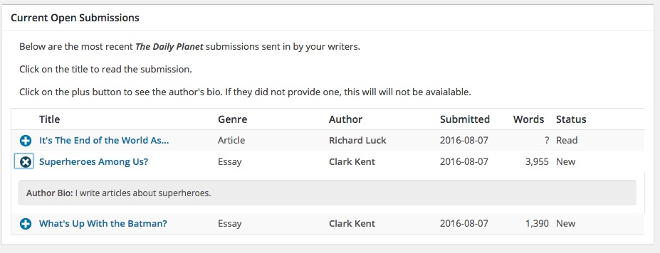
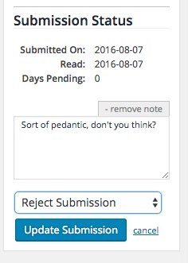

## HeyPublisher Submisson Manager

HeyPublisher gives you a better way of managing submissions directly within WordPress.

### Description

This plugin allows you to accept submissions from writers without creating accounts for them in WordPress.  You define categories and other filters to ensure you only receive the submissions that meet your publication's needs.

#### How HeyPublisher Submission Manager Helps

Normally if you wanted to allow readers to submit their writing to your publication you would need to create an account in WordPress for each writer, then educate them on how to write and edit Posts within the publishing tool.

With this plugin, submissions to your publication are uploaded to the  [HeyPublisher](https://www.heypublisher.com) web-service.  The plugin gives you the ability to review the submissions within WordPress.  You no longer have to manage user accounts or worry about unwanted posts filling up your system.

Mark submissions for review, accept submissions for publication, or reject submissions to remove them from your slush pile.  All acceptance/rejection communications with the writer are handled automatically by HeyPublisher using email templates you can easily manage from within WordPress.

You define the type of writing you want to receive.  You control the flow of content coming into your publication.  You have more time to run your publication.

### Installation

#### Install Plugin

* Go to the [HeyPublisher GitHub repository](https://github.com/HeyPublisher/heypublisher-submission-manager) and download the plugin.

* Click on the Download ZIP link and save it in your `wp-content/plugins` directory.

* Extract the files to a sub-directory called `heypublisher-submission-manager`.

  *Using cURL, you can do:*

  `curl -Lo heypub.zip https://github.com/HeyPublisher/heypublisher-submission-manager/archive/master.zip && unzip heypub.zip && mv heypublisher-submission-manager-master heypublisher-submission-manager`

* Active the plugin via the WordPress plugin menu.

* Once installed and activated, you will be able to update the plugin within WordPress by clicking on the link provided.

#### Validate Plugin

Once activated you will need to validate the plugin by clicking on the HeyPublisher link in the newly created menu and follow the on-screen instructions.

To validate the plugin you will need to provide basic information about your publication and yourself as the administrator of this publication:

If your publication already exists in the [HeyPublisher.com](https://heypublisher.com/publishers/search) database, enter the name _exactly as it appears_ in our database.  If it doesn't already exist, simply enter the name as you want it to appear within our database.

If you already have an account with HeyPublisher, enter the email address and password you use to login.  If you do not already have an account, enter the email address and password you would like to use.  This username and password will be used if you ever need to reinstall or upgrade the plugin.  This information is also used to ensure that **_ONLY YOU_** can modify your publication's listing in the HeyPublisher database.

#### Configure Plugin

After the plugin has been validated, you can configure it to meet your submission requirements.  All information entered on this screen is used by HeyPublisher to help filter the submissions you receive.  The configuration sections are:

* **Publication Information:** this includes the name, URL, editor, and physical mailing address of your publication.

* **Contact Information:** tell us who to contact for your publication if we have questions.

* **Submission Guidelines:** select the page that contains your submission guidelines (if applicable).

* **Submission Form:** select or create the page that will contain your submission form on your website.

* **Submission Criteria:** select which genres of work you will accept - and how those should map to your internal categories when you "accept" a work for publication.  Additionally, you can select whether or not to accept simultaneous submissions and multiple submissions.

* **Notification Options :** indicate the submission states where you want to send notifications to the writer.  This works in conjunction with the Response Templates feature, where you can customize the emails sent to writers.

<!--
* **Payment Options :** indicate whether or not your publication pays writers for their work.
-->

* **Miscellaneous :** configuration to help you clean up bad HTML formatting.

Once you have made the appropriate configurations, click the "Save" button.

### Frequently Asked Questions

If you have any questions not addressed here, [please email us](mailto:support@heypublisher.com?subject=Question+about+plugin).

* **What happens when I save a submission for later review?**
If you do not allow simultaneous submissions, this puts a 'lock' on the work preventing the writer from submitting it to another press while you are considering whether or not to publish it.  The writer, however, may choose to withdraw their submission if it stays in this state for too long.

* **What happens when I accept a submission?**
When you accept a submission, a copy of that submission is inserted as a Post into your WordPress system.  The post is marked as 'pending' so you can easily find the accepted submission and make any necessary edits to it prior to publication.

* **What happens when I reject a submission?**
When you reject a submission it is immediately removed from your slush pile and the writer is notified of your decision automatically.  If the work had previously been 'accepted' by you, then rejecting it would also remove it from your pending posts.

* **Can I reject a published submission?**
No - once you publish an accepted submission, the author is automatically notified that their work has been published by you and the work is removed from your "Submissions" administration  screen.

* **We don't have submission guidelines.  Can we still use HeyPublisher?**
Yes - absolutely.  The plugin allows you to either select a Page in your WordPress publication, or input custom submission guidelines.  These guidelines will be made visible to writers who are interested in submitting to your publication.  

* **Can we change the content of the emails sent to writers regarding their submissions?**
Yes - you can define custom response templates that contain whatever message you want to send to your writers.  These emails are sent automatically whenever you reject, accept, or save a submission for later review.  An email is also sent the first time an editor reads a new submission.  Click on 'Response Templates' in the side-bar and follow the on-screen instructions.

### Managing the Slushpile
#### Open Submissions

From this screen you can view and manage the submissions received by your publication.  Clicking on the plus icon will display the author's bio, if they have provided one.  Clicking on the title of the submission will allow you to 'preview' the submission.

#### Submission Status

When 'previewing' a submission, the submission status will show up on the right side of the screen, giving you a quick overview of the status of the submission.  This status includes when the submission was submitted, when it was last viewed, and allows you to accept or reject the submission.  Any note you add to the submission here will be sent to the author if you have Writer Notifications turned on.

#### Reimport

If for some reason you need a writer to submit an update to their submission after you have already accepted it, simply go to the submission in the Open Submissions screen and select "Reimport Into WordPress".  Once you click the "Update Submission" button the new version will be imported, overwriting the previous version of the Post.

### Statistics

The homepage of the plugin will give you a quick snapshot of your slushpile.

