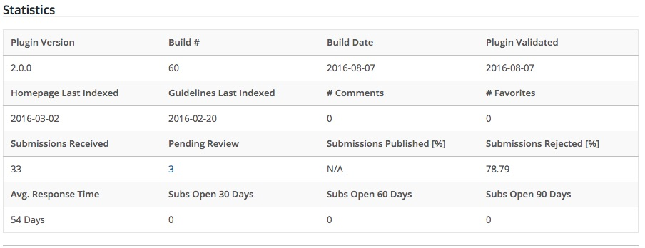

## HeyPublisher Submisson Manager

HeyPublisher gives you a better way of managing submissions directly within WordPress.

### Description

This plugin allows you as to accept submissions from writers.  You define categories and other filters to ensure you only receive the submissions that meet your publication's needs.  And there is no need to create user accounts for writers just so they can submit content to your publication.

#### How HeyPublisher Submission Manager Helps

Normally if you wanted to allow readers to submit their writing to your publication you would need to create an account in WordPress for each writer, then educate them on how to write and edit Posts within the publishing tool.

With the HeyPublisher Submission Manager plugin submissions to your publication are instead uploaded to the  [HeyPublisher](https://www.heypublisher.com) web-service.  You still review the submissions within WordPress.  But you no longer have to manage user accounts or worry about unwanted posts filling up your system.

Mark submissions for review, accept submissions for publication, or reject submissions to remove them from your slush pile.  All acceptance/rejection communications with the writer are handled automatically by HeyPublisher, freeing you from the time-consuming task of having to respond to each submission individually.

You define the type of writing you want to receive.  You control the flow of unsolicited content coming into your publication.  You have more time to run your publication.

### Installation

#### Install Plugin

* Download the zip file and save it in your `WordPress/wp-content/plugins` directory.

* Extract the files to a subdirectory called `heypublisher-submission-manager`.

* Active the plugin via the WordPress plugin menu.

Once activated you will need to 'validate' the plugin with the HeyPublisher web-service.  To do this click on the HeyPublisher link in the newly created menu and follow the on-screen instructions.

#### Validate Plugin

To validate the plugin you will need to provide basic information about your publication and yourself as the administrator of this publication:

* Your publication name
* Your publication url
* Your email address
* A password

If your publication already exists in the [HeyPublisher.com](https://heypublisher.com/publishers/search) database, enter the name _exactly as it appears_ in our database.  If it doesn't already exist, simply enter the name as you want it to appear within our database.

If you already have an account with HeyPublisher, enter the email address and password you use to login.  If you do not already have an account, enter the email address and password you would like to use.  This username and password will be used if you ever need to reinstall or upgrade the plugin.  This information is also used to ensure that **_ONLY YOU_** can modify your publication's listing in the HeyPublisher database.

#### Configure Plugin

After the plugin has been validated, you can configure it to meet your submission requirements.  All information entered on this screen is used by HeyPublisher to help filter the submissions you receive.  The configuration sections are:

* **Publication Information:** this includes the name, URL, editor, and physical mailing address of your publication. (Screenshot 2)

* **Submission Form:** select or create the page that will contain your submission form on your website. (Screenshot 3)

* **Submission Guidelines:** select the page that contains your submission guidelines (if applicable). (Screenshot 4)

* **Submission Criteria:** select which genres of work you will accept - and how those should map to your internal categories when you "accept" a work for publication.  Additionally, you can select whether or not to accept simultaneous submissions and multiple submissions. (Screenshot 5)

* **Notification Options :** indicate the submission states where you want to send notifications to the writer.  This works in conjunction with the Response Templates feature, where you can customize the emails sent to writers.

* **Payment Options :** indicate whether or not your publication pays writers for their work.

* **Miscellaneous :** configuration to help you clean up bad HTML formatting.

Once you have made the appropriate configurations, click the "Save" button.

### Frequently Asked Questions

If you have any questions not addressed here, [please email us](mailto:support@heypublisher.com?subject=Question+about+plugin).

* **What happens when I save a submission for later review?**
If you do not allow simultaneous submissions, this puts a 'lock' on the work preventing the writer from submitting it to another press while you are considering whether or not to publish it.  The writer, however, may choose to withdraw their submission if it stays in this state for too long.

* **What happens when I accept a submission?**
When you accept a submission, a copy of that submission is inserted as a Post into your WordPress system.  The post is marked as 'pending' so you can easily find the accepted submission and make any necessary edits to it prior to publication.

* **What happens when I reject a submission?**
When you reject a submission it is immediately removed from your slush pile and the writer is notified of your decision automatically.  If the work had previously been 'accepted' by you, then rejecting it would also remove it from your pending posts.

* **Can I reject a published submission?**
No - once you publish an accepted submission, the author is automatically notified that their work has been published by you and the work is removed from your "Submissions" administration  screen (Screenshot 7)

* **We don't have submission guidelines.  Should we create them?**
Yes - absolutely.  HeyPublisher indexes and archives all publisher submission guidelines, making them immediately searchable by writers around the world.  It's important as a publisher to be very clear with writers beforehand about what you are looking for in terms of genre, length, quality and content.

* **Can we change the content of the emails sent to writers regarding their submissions?**
Yes - you can define custom response templates that contain whatever message you want to send to your writers.  These emails are sent automatically whenever you reject, accept, or save a submission for later review.  An email is also sent the first time an editor reads a new submission.  Click on 'Response Templates' in the side-bar and follow the on-screen instructions.

### Screenshots

1. Plugin Validation Screen.  This is how you connect the plugin to HeyPublisher.  Input the username and password you want to create (if you don't already have a HeyPublisher account).

2. Publication Information screen.  Input how you want your publication to appear within HeyPublisher's database.

3. Publication Contact information. Input the contact information for how writers should reach you if they have a question about their submission.

4. Submission Form Configuration.  Create (or select) the page in your WordPress site that contains your Submission Guidelines and Submission Form.  If the Submission Form page does not already exist, click the link and the plugin will create it for you.

5. Submission Categories. Select the types of work you want to accept, and how these correspond to the categories you've created in WordPress.

6. Writer Notifications.  Select YES for those notifications you want the writer to receive.

7. Miscellaneous.  You can probably keep this on the default setting.  Adjust only if  you accept submissions in languages and character sets different than the one you publish.

8. Open Submissions.  From this screen you can view and manage the submissions received by your publication.  Clicking on the plus icon will display the author's bio, if they have provided one.  Clicking on the title of the submission will allow you to 'preview' the submission.

9. Submission Status.  When 'previewing' a submission, the submission status side-bar will give you a quick status on the submission, including how many days it's been in your slushpile.  From this side-bar you can choose to accept or reject the submission.  Any note you add to the submission will be sent to the author if you have Writer Notifications turned on.

10. Statistics screen.  Provides a quick snapshot of your slushpile.

11. Reimport.  If a writer modifies a submission you have already 'Accepted' - you can re-import the submission into WordPress by selecting the "Reimport Into WordPress" value from the drop-down and clicking the "Update Submission" button.

### About Us

HeyPublisher builds tools for writers and publishers.  Find out more by visiting our website [HeyPublisher.com](https://www.heypublisher.com).

## About This Plugin

+ WordPress minimum version: 4.0
+ WordPress version tested up to: 4.9.4
+ Current Stable Tag: 2.8.2
+ License: GPLv2
